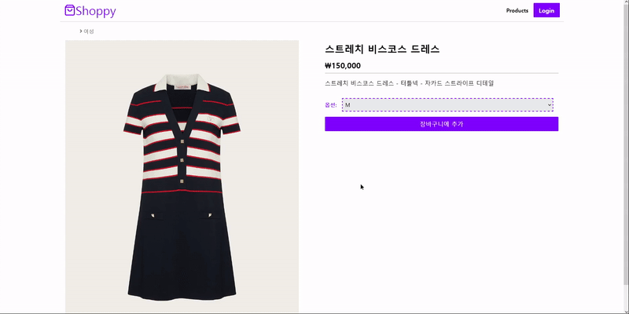
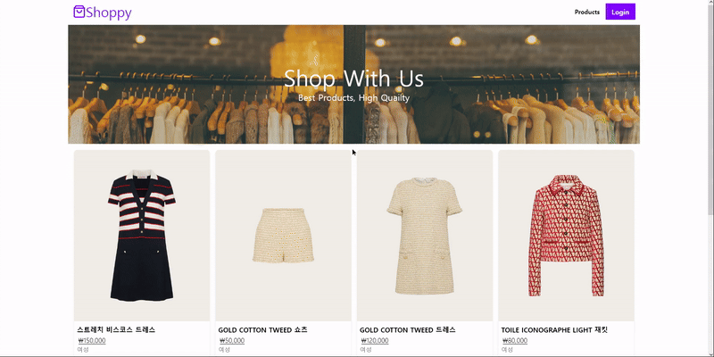
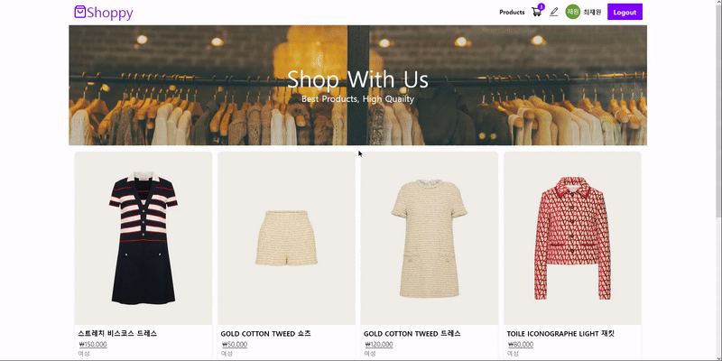
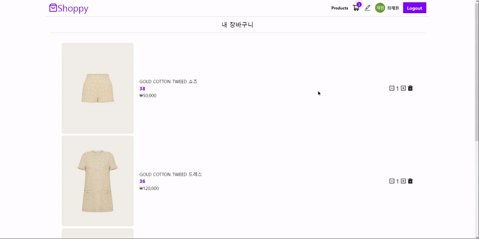
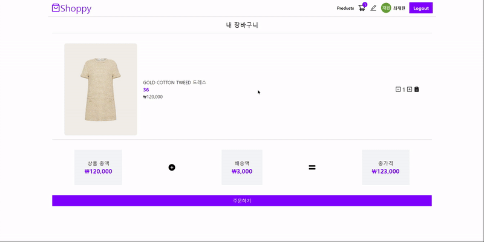
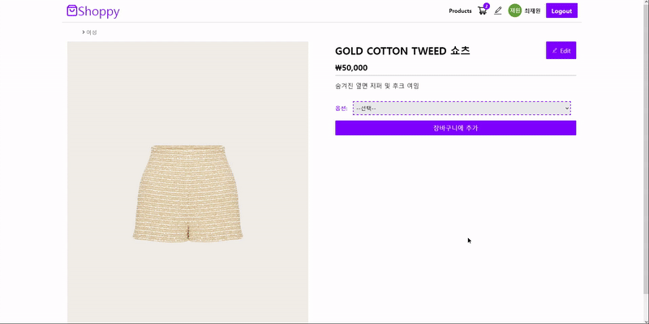
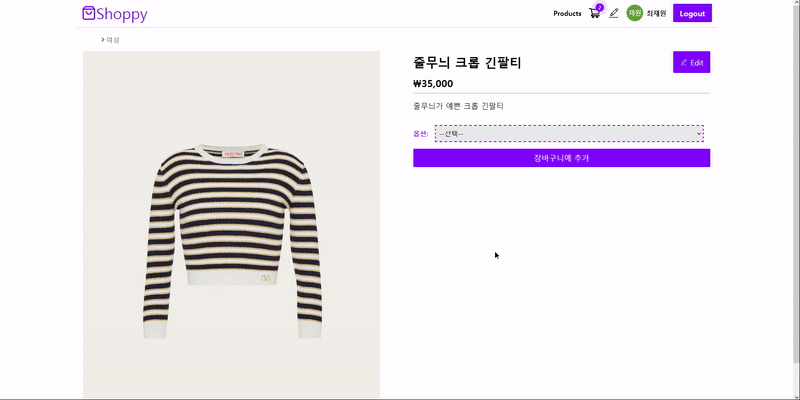

# 쇼핑사이트 클론코딩

### 드림코딩 아카데미에서 react 강의를 들으면서 만들어본 쇼핑 사이트

### 사용한 기술 스택:

- ### React
- ### Firebase
- ### Cloudinary
- ### TailwindCSS
- ### React-Query

### 기본적인 쇼핑몰 사이트의 기능을 구현해봤습니다.

### 배포된 앱 [URL](https://shoppy-project-choi.netlify.app/)

## 첫 화면

## 상품 페이지

## 상품 상세페이지

## 로그인 전 장바구니에 추가

로그인 전에는 장바구니에 추가할 수 없도록 만들었습니다. 알림창도 추가하였습니다.

## 구글 로그인

로그인 기능은 구글로그인만 추가하였습니다.

## 장바구니 추가

로그인 후 장바구니에 추가가 가능하며 추가하였다는 알림이 뜨게됩니다.

## 장바구니 페이지

장바구니 아이콘에서 추가한 아이템의 개수가 표기되고 장바구니 페이지에서 내가 추가한 상품과 가격을 볼 수 있습니다.

## 장바구니 상품 수량 추가 및 제거

장바구니 상품들의 수량을 추가하거나 제거 할 수 있습니다.

## 같은 상품에서 다른 옵션을 추가할때

다른옵션일 경우 따로 추가하도록 하였습니다. 제품 이미지를 클릭하면 제품 상세페이지로 이동 가능합니다.

## 상품 수정

관리자권한 계정으로 상품정보를 수정할 수 있습니다.

## 상품 제거

관리자권한 계정으로 상품정보를 제거할 수 있습니다.

## 상품 추가

관리자권한 계정으로 상품을 추가할 수 있습니다.

## 추가하고 싶은 기능

- ### search
- ### payment system

제품 검색 기능과 장바구니에서 결제까지 이어지는 기능을 추가 하고 싶습니다.

## 어려웠던 부분

- ### API 부분을 별도로 관리하는것
- ### hook으로 useQuery부분 관리하는 것
- ### UI로직과 Business로직을 완전히 분리해서 관리하는 것
- ### cloudinary 세팅과 사용법
- ### firebase 세팅과 사용법

## Firebase를 사용한 이유

- ### Authentication 서비스 작성이 편리함
- ### OAuth 사용이 편리함
- ### Database를 간편하게 사용 가능

## Cloudinary를 사용한 이유

- ### firebase를 사용하면서 image를 저장하기 위한 용도로 사용

## React-Query를 사용한 이유

- ### 데이터 쿼리, 뮤테이션, 캐싱 처리가 편함

## Tailwindcss를 사용한 이유

- ### 클래스 기반 스타일링이기 때문에 스타일 작성이 빠르고 편리함
- ### 단점은 애니메이션 작성이 힘듬
